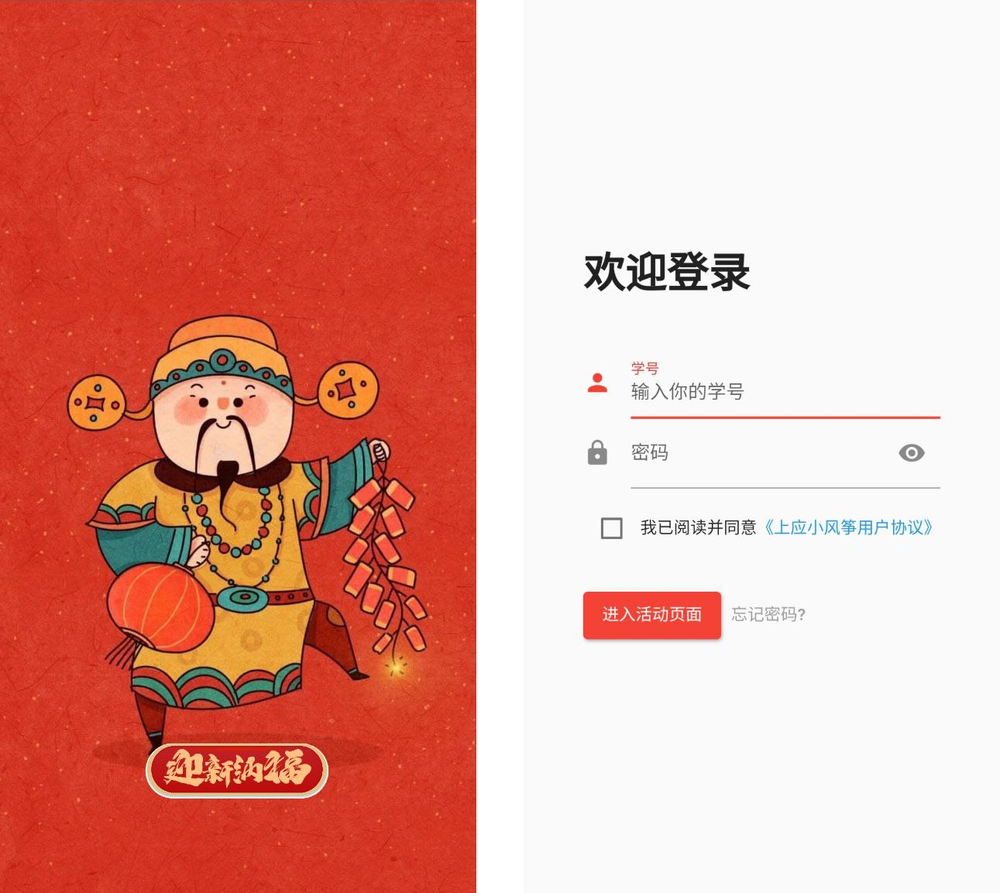

# 2023 兔年 "五福" 活动

该活动借鉴支付宝 “扫福赢福卡” 活动, 通过 "扫校徽赢福卡" 的方式展开, 当用户集齐全套福卡后, 可以前往易班工作站领取奖品. 项目于 2021 年底由上海应用技术大学易班工作站发起，技术部分由技术部负责.

技术上, 后端部分由 rust 和 python 语言混合编写，见 [kite-badge](https://github.com/SIT-kite/kite-badge). 当前仓库为前仓库, 使用 dart 语言和 flutter 框架构建 (Dart 2.18.6, flutter 3.3.10).

由于 Android 和 iOS 平台对浏览器限制的差异、国产基于 Chromium 的浏览器更新落后问题以及 Web 的 Camera API 存在两套事实的标准，我们使用了兼容性最好的一套 js 方案，并通过 flutter 框架与 js 通信的方式实现摄像预览。该方案在 iOS 中只支持使用 Safari 浏览器。在我们的测试中，Firefox 浏览器的兼容性表现十分优异，但其在个人用户市场的份额较少。

## 截图

为了让你更直观地了解这个项目，我们在这里用截图展示：




## 文档

接口文档参见 [kite-server/docs/APIv2/集五福.md](https://github.com/SIT-kite/kite-server/blob/v2/docs/APIv2/%E9%9B%86%E4%BA%94%E7%A6%8F.md)
.

## 使用

``` shell
git clone https://github.com/SIT-kite/kite-fu.git
cd kite-fu

flutter pub get
flutter pub run build_runner build
flutter pub run flutter_native_splash:create
flutter build web
```

生产环境的代码在编译时的完整命令如下：

``` shell
flutter build web --web-renderer=html --base-href=/fu/ --no-source-maps --no-null-assertions --no-native-null-assertions --release
```

## 版权

本项目使用 GPLv3 协议授权。

项目中用到的全页面背景图片，除 `2.png` 外，均来源于小米主题商店；
其余福卡、福字图片等, 由上海应用技术大学易班工作站制作；
版权归作者所有。
